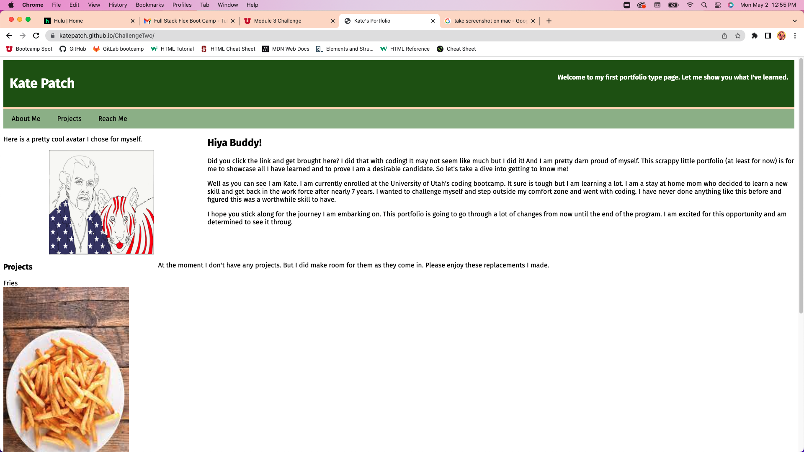

# ChallengeTwo

I got the image for the french fries at the link <https://www.thebossykitchen.com/how-to-make-real-potato-french-fries-grandma-style/>

I no longer need the pic for fries but I am leaving the info here.

added image of my puppy for portfolio work spot.  will be replaced in time as portfolio is added to through this class and other work.

I really enjoyed this challenge.  I came into this bootcamp with no previous knowledge and now I built my own portfolio.  Is it perfect?  Hardly but I have to say that I am very proud of what I did this week.  I can't wait until I gain more and more to make it even better.  

I think I can say that I need more time with the design/display of the page.  But I worked with what I know and lots and lots of Googling.

## project one

I have added the deployed URL for the first project I collobrated on with a group from class.  We each worked really hard to make our site.  We worked really well together and were willing to help with whatever made someone stuck.  

If you click the picture it will open a new tab and take you to the live site.

## project two

Here is the deployed URL through Heroku for project 2.  Our group did a blog called Movie Club where a reviewer shares their reviews on movies.  Visitors can login and comment on the reviews and see all their previous comments in their profile.  This was a great group and I am glad we worked together well.  We each helped eachother and did our best to contribute equally.

